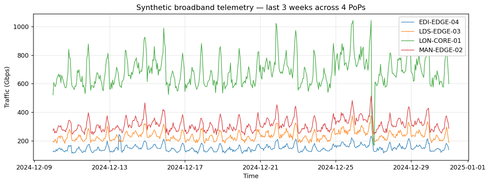
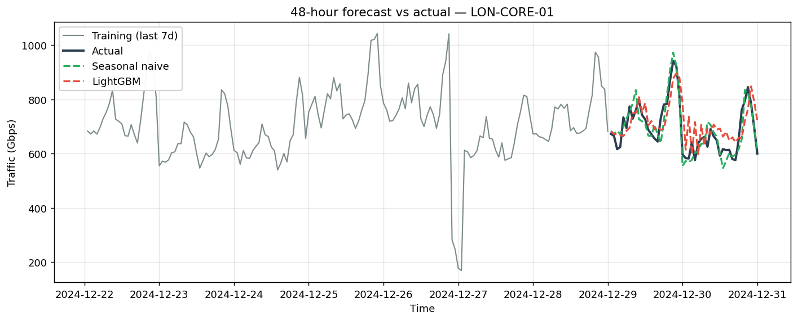
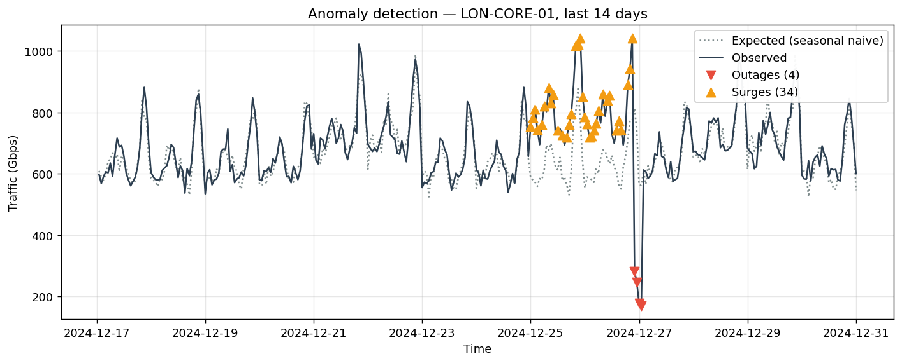

# Network Capacity Forecasting & Anomaly Detection

**🔗 [Live dashboard](https://naveed-network-forecast.streamlit.app)** · [Architecture notes](docs/architecture.md)

[](https://naveed-network-forecast.streamlit.app)
[](https://github.com/Naveed-0730/network-capacity-forecast/actions/workflows/ci.yml)
[](https://www.python.org/downloads/)
[](LICENSE)
[](https://github.com/astral-sh/ruff)

End-to-end time series forecasting and anomaly detection pipeline for broadband
network telemetry, built around the operational questions a Network Data
Scientist actually gets asked: *how much capacity will we need next week?*
and *did something just break, or is that surge real?*

Two years of synthetic hourly traffic across four UK Points of Presence
(LON-CORE-01, MAN-EDGE-02, LDS-EDGE-03, EDI-EDGE-04), three forecasting
models compared with walk-forward validation, a MAD-based anomaly detector,
and a Streamlit dashboard for stakeholder exploration.



---

## What this project demonstrates

| Capability | Where it lives |
|---|---|
| Time-series forecasting (SARIMA, LightGBM, seasonal-naive baseline) | `src/network_forecast/forecasters.py` |
| Walk-forward validation with 4 metrics (MAE, RMSE, MAPE, sMAPE) | `src/network_forecast/evaluation.py` |
| Anomaly detection via robust residual scoring | `src/network_forecast/anomaly.py` |
| SQL feature engineering on Parquet via DuckDB | `src/network_forecast/sql_features.py` |
| Streamlit dashboard for stakeholder review | `dashboard/app.py` |
| Clean OO design — abstract `Forecaster` base, factory pattern | `src/network_forecast/forecasters.py` |
| Custom exceptions, input validation, type hints throughout | every module |
| 46 unit tests, GitHub Actions CI on Python 3.10 / 3.11 / 3.12 | `tests/`, `.github/workflows/ci.yml` |

---

## Quick start

```bash
# 1. Clone and install
git clone https://github.com/Naveed-0730/network-capacity-forecast.git
cd network-capacity-forecast
pip install -e ".[dashboard,dev]"

# 2. Generate the synthetic dataset (~70k hourly observations)
python -m network_forecast.data_generator

# 3. Run the model comparison
python scripts/compare_models.py

# 4. Run anomaly detection
python scripts/detect_anomalies.py

# 5. Launch the dashboard
streamlit run dashboard/app.py
```

Tests:

```bash
pytest                           # full suite (~2 seconds)
pytest --cov=network_forecast    # with coverage
ruff check src tests             # lint
```

---

## Headline results

### Forecasting (24-hour-ahead, walk-forward across 4 folds)



| PoP | Seasonal Naive — MAE | LightGBM — MAE | Winner |
|---|---:|---:|---|
| LON-CORE-01 | **36.09** | 68.86 | Seasonal naive |
| MAN-EDGE-02 | **12.70** | 23.31 | Seasonal naive |
| LDS-EDGE-03 | **11.16** | 18.86 | Seasonal naive |
| EDI-EDGE-04 | **8.29**  | 11.03 | Seasonal naive |

**The interesting result: seasonal naive beats LightGBM on every PoP.**

This is the kind of finding a Network Data Scientist needs to be honest about
rather than hiding behind a more impressive-looking model. Network telemetry
has a very strong, very regular weekly pattern — `y_t = y_{t-168h}` is genuinely
hard to beat on stable links. LightGBM would only start to pull ahead when:

- traffic patterns change rapidly (new product launches, marketing campaigns)
- the model can ingest exogenous features (subscriber counts, weather, sports
  fixtures, content release schedules)
- forecast horizons stretch beyond a week, where the naive model degrades

The point of running this comparison is not to find a winner — it's to *know
when the simple baseline is sufficient*, which is the right answer surprisingly
often in production.

### Anomaly detection



100% recall on the held-out 14-day window across all four PoPs at threshold = 3.5
MAD-σ. The detector trades off precision (some false positives during sustained
growth periods, since the seasonal-naive baseline doesn't account for trend) —
production would use a trend-adjusted baseline or a forecasting model like
LightGBM as the "expected" reference instead.

---

## Architecture

```
┌─────────────────┐     ┌──────────────────┐     ┌──────────────────┐
│  Data generator │────▶│  Parquet store   │────▶│  SQL features    │
│  (synthetic)    │     │  (hourly × PoP)  │     │  (DuckDB)        │
└─────────────────┘     └──────────────────┘     └──────────────────┘
                                 │
                                 ▼
                        ┌──────────────────┐
                        │   Forecaster     │ ← abstract base class
                        │   (ABC)          │
                        └──────────────────┘
                                 △
                  ┌──────────────┼──────────────┐
                  │              │              │
        ┌─────────────────┐ ┌─────────┐ ┌──────────────┐
        │  SeasonalNaive  │ │ SARIMA  │ │  LightGBM    │
        └─────────────────┘ └─────────┘ └──────────────┘
                  │              │              │
                  └──────────────┼──────────────┘
                                 ▼
                        ┌──────────────────┐
                        │  walk_forward    │
                        │  _eval (MAE,     │
                        │  RMSE, sMAPE)    │
                        └──────────────────┘
                                 │
                                 ▼
                        ┌──────────────────┐
                        │  Residual-based  │
                        │  anomaly         │
                        │  detector (MAD)  │
                        └──────────────────┘
                                 │
                                 ▼
                        ┌──────────────────┐
                        │  Streamlit       │
                        │  dashboard       │
                        └──────────────────┘
```

Every forecaster implements the same `fit(series) → self` and `predict(horizon)
→ ForecastResult` interface, so the dashboard, evaluator, and CI tests are
model-agnostic. Adding a new model (Prophet, NeuralProphet, transformer-based)
is a single new class, no other code changes required.

---

## Code quality choices

This project deliberately leans into the engineering practices the JD calls
out — **abstraction, exception handling, testing, maintainability** — rather
than just demonstrating "I can fit a model".

- **Custom `NotFittedError`** rather than generic `RuntimeError`, so callers
  can specifically catch fit-state problems.
- **Strict input validation in `Forecaster._validate_series`** — wrong index
  type, NaNs, or too-short series fail fast with a clear message.
- **`ForecastResult` dataclass** instead of returning bare arrays, so
  uncertainty intervals and timestamps travel together as a unit.
- **Walk-forward, not random k-fold**, because random folds leak future
  information into training and produce optimistic metrics.
- **MAD-based anomaly detection** instead of mean + std, because past
  anomalies inflate std and hide future ones.
- **DuckDB for SQL feature engineering** on Parquet — every query is portable
  to Snowflake / BigQuery / Redshift.

---

## Testing

```
46 tests passing in 1.84s
```

- `tests/test_data_generator.py` — pattern correctness, determinism, edge cases
- `tests/test_forecasters.py` — fit/predict semantics, error paths, factory
- `tests/test_evaluation.py` — metric correctness on known inputs, walk-forward semantics
- `tests/test_anomaly.py` — calibration, detection, threshold sensitivity, false-positive rate

Run on every push to `main` or pull request via GitHub Actions across
Python 3.10, 3.11, and 3.12.

---

## What's *not* in scope

A short list to head off the obvious "but where's…" questions:

- **Real telemetry** — every operator's network data is commercially sensitive,
  so the dataset is synthetic but built to mimic the seasonality, holiday
  effects, and outage patterns that show up in real broadband telemetry.
- **Multivariate exogenous features** — subscriber counts, weather, sports
  fixtures would all improve LightGBM's standing. They're a deliberate
  next-step rather than something I've faked.
- **Production deployment** — no Airflow DAG, no MLflow registry, no
  monitoring. The code is clean enough to plug into one, but I didn't want
  to scaffold infra that doesn't run anywhere visible.

---

## Author

**Naveed Abbas** · MSc Data Science and Analytics, University of Leeds
(First Class) · ex-ML Researcher at the Met Office, UK

[LinkedIn](https://www.linkedin.com/in/naveedabbasds) · [Email](mailto:naviabbast@gmail.com)
